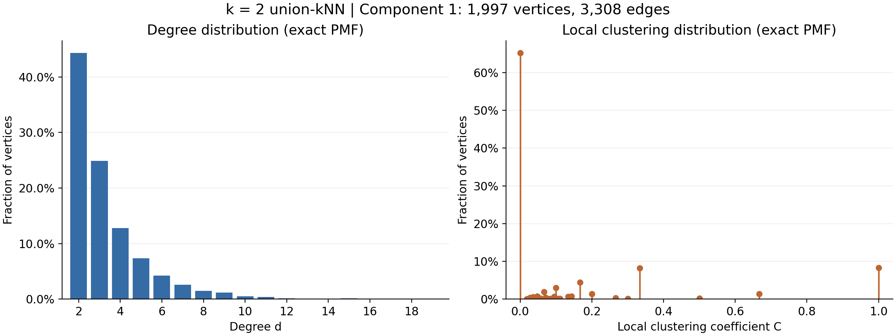
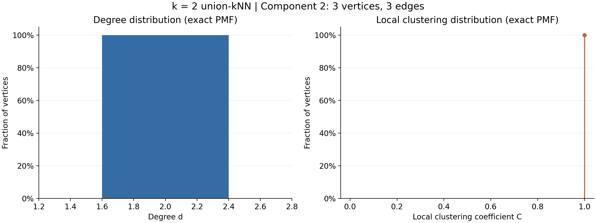

# E4：组合连通性分析（k=2）

## 图和分析范围

读取项目已有的 `results/graphs/k002.npz`，不重新生成特征或近邻。该图为无向、无自环的**并集对称化 kNN 图**：只要任一端把另一端列为最近的两个邻居，就保留这条边。因此 k=2 不代表每个节点的最终度都是 2。

全图包含 2000 个节点、3311 条无向边，两个连通分量大小为 1997 和 3。1997 节点分量占全图 99.85%，是本题分析的大连通分量；3 节点分量作为补充单独给出，不与大分量混合统计。分量编号按节点数降序排列，从 1 开始。

## 定义

本题采用组合图指标，将原始高斯相似度边权转为是否连接的二值邻接矩阵 B。

- 度：`d(v) = sum_u B[v,u]`，即邻居数量，而非边权之和。
- 局部聚类系数：`C(v) = 2 T(v) / (d(v)(d(v)-1))`，其中 T(v) 是包含 v 的三角形数；度小于 2 时定义为 0（本图无此情形）。
- 图中纵轴为节点比例，即经验概率质量函数 PMF。聚类系数按精确有理数归并，因此没有直方图分箱造成的形状偏差。

## 大连通分量的结果

| 指标 | 数值 |
|---|---:|
| 节点数 | 1997 |
| 无向边数 | 3308 |
| 度的最小值 / 最大值 | 2 / 19 |
| 平均度 | 3.312969 |
| 度的中位数 / 众数 | 3 / 2 |
| 度的偏度（校正样本偏度） | 2.362917 |
| 度为 2 的节点比例 | 44.32% |
| 度不超过 4 的节点比例 | 81.97% |
| 平均局部聚类系数 | 0.140104 |
| 局部聚类系数中位数 | 0.000000 |
| C=0 的节点数 / 比例 | 1302 / 65.20% |
| C=1 的节点数 / 比例 | 165 / 8.26% |
| 三角形总数 | 322 |
| 全局传递性（供参考） | 0.087762 |

**度分布类型：**离散、单峰且右偏的经验分布。峰值位于 d=2，多数节点只有少量邻居，较高的度对应越来越少的节点，观测范围为 2–19。每个节点主动选择两个邻居，其他节点的选择又可能增加其度，这解释了最小度为 2 及向右延伸的形状。这里采用形状描述；仅凭有限范围的右尾不能认定其服从幂律、指数或泊松分布，也不能据此称为无标度网络。

**局部聚类系数分布类型：**在 [0,1] 上的离散分布，具有显著的零值集中和多个有理数尖峰。C=0 的质量为 65.20%，说明这些节点的邻居之间没有连接；C=1 的质量为 8.26%，表示这些节点的邻居形成完全子图。小度节点可取的系数值很少，例如度为 2 时只有 0 和 1，因此尖峰是稀疏图的自然结果。它不宜被描述为连续正态分布，也不在此强行拟合某种参数分布。平均局部聚类系数是逐节点平均，全局传递性则按可形成三角形的邻居对加权，两者并不相同。

## 小分量（补充）

剩余 3 个节点形成完整三角形 K3，有 3 条边。所有节点度为 2，所有局部聚类系数为 1；对应分布分别是集中在 d=2 和 C=1 的退化分布（单点分布）。

## 可直接用于作业的英文结论

For the undirected union-symmetrized k=2 nearest-neighbor graph, the connected components contain 1,997 and 3 vertices. We analyze the 1,997-vertex component as the large component using unweighted combinatorial degree and local clustering coefficients. Its degree distribution is discrete, unimodal and right-skewed, with mode 2, mean 3.3130, and observed range 2–19. Most vertices have low degree; 81.97% have degree at most 4. The local clustering distribution is discrete on [0,1], with pronounced mass at zero (65.20%) and several rational-valued spikes; its mean is 0.1401. These spikes reflect the small vertex degrees and the limited possible numbers of edges among neighbors. These are empirical shape descriptions, not claims of a fitted parametric law. The remaining component is K3, whose degree and clustering distributions are point masses at 2 and 1, respectively.

## 文件与复现

- `component_01_distributions.png/.svg`：大分量的度分布及局部聚类系数分布，PNG 用于查看，SVG 用于无损缩放。
- `component_02_distributions.png/.svg`：小分量的补充图。
- `component_XX_degree_pmf.csv`、`component_XX_clustering_pmf.csv`：分布的精确计数与概率。
- `node_metrics.csv`：每个节点的度、三角形数、聚类系数；global_node_index 对应原始 `results/nodes.jsonl`。
- `component_summary.csv`、`summary.json`：汇总统计、输入文件 SHA-256 及验证项目。
- 分析脚本位于 [`code/analyze_e4.py`](../../../code/analyze_e4.py)：在 `MusicGraphAnalysis` 根目录运行 `python code/analyze_e4.py`，结果输出到 `results/E4/_degreeDistribution`，需要 numpy、scipy、matplotlib、networkx。

已验证图的对称性、无自环、k=2 近邻并集结构、连通分量划分及握手定理，并用 NetworkX 独立核对所有节点的局部聚类系数。
