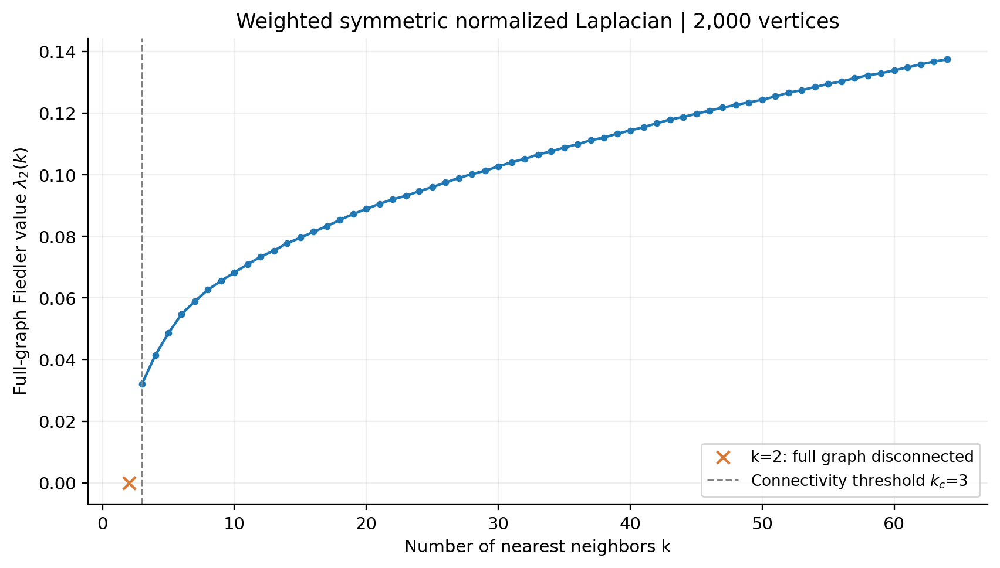
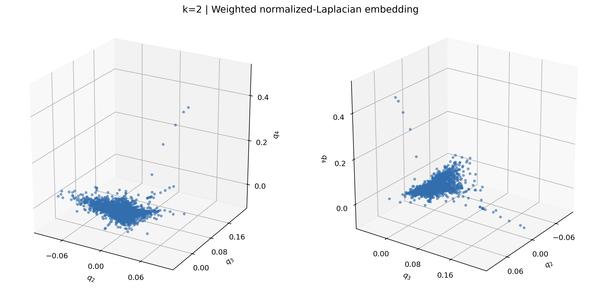
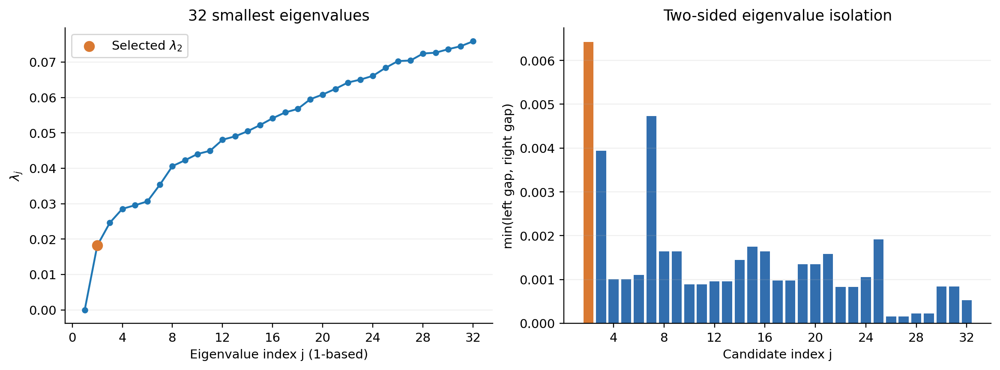
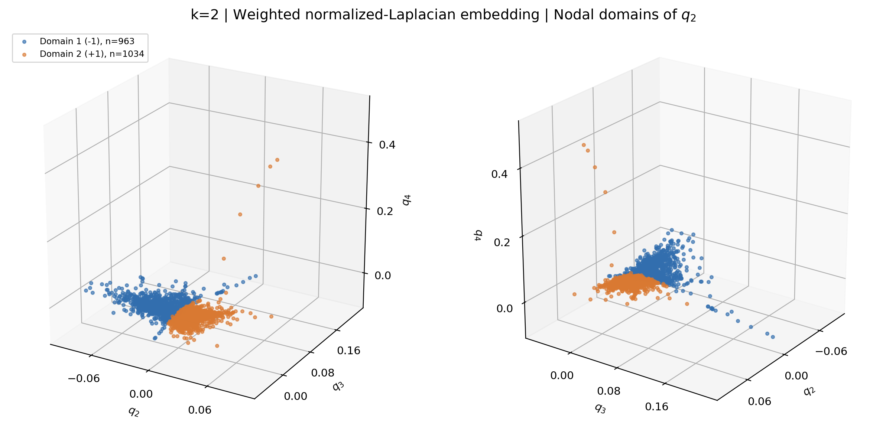
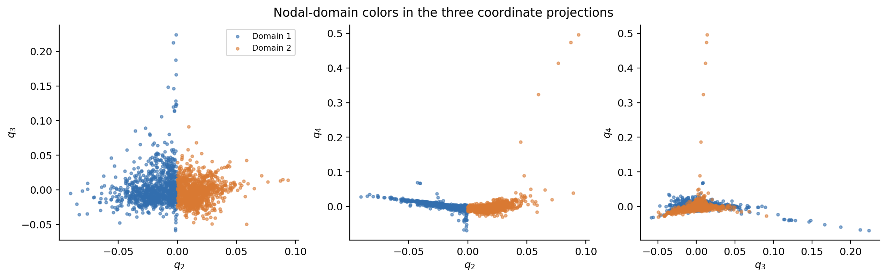
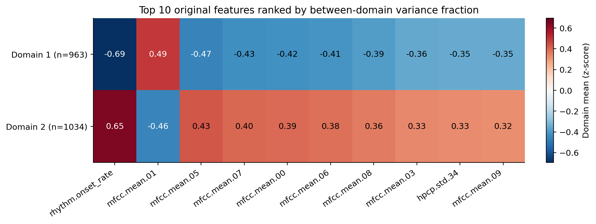
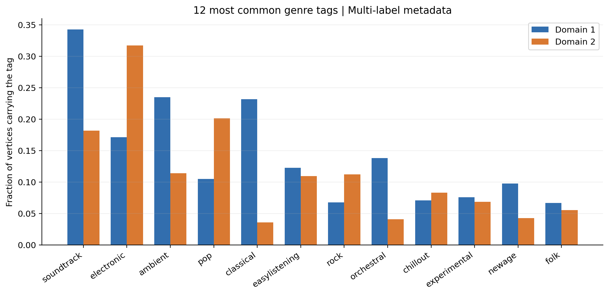

# E5：Laplacian spectral analysis

## 1. 图与归一化拉普拉斯矩阵

分析采用 **k=2、32 维 PCA 后的并集对称化 kNN 图**。原图有 2000 个节点，连通分量大小为 1997 和 3；本题的大连通分量为 1997 节点、3308 条无向边的分量。

E5 使用原图的高斯相似度权重 A，而 E4 的组合度和聚类系数只使用连接结构。令 `D_ii = sum_j A_ij`，构造对称归一化拉普拉斯矩阵：

`L_sym = I - D^(-1/2) A D^(-1/2)`。

D 是加权度（strength），不能替换成无权邻居数量。该分量无孤立节点，L_sym 对称半正定，特征值位于 [0,2]。全文按 `lambda_1 <= lambda_2 <= ...` 从 1 开始编号，`lambda_1 = 0`；对应零特征向量正比于 `sqrt(D_ii)`。矩阵保存为 `component_01_L_sym.npz`。

## 2. 连通阈值与 Fiedler 值随 k 的变化



k=1 时有 288 个连通分量；k=2 有两个分量；k=3 全图连通。固定近邻顺序下，并集 kNN 边集随 k 嵌套，因此最小连通阈值为 **k_c=3**。对已有的每张 k=3,...,64 图，用相同高斯边权定义计算全体 2000 个节点的 L_sym 和第二小特征值。

- `lambda_2(3) = 0.03215373`。
- `lambda_2(64) = 0.13746997`。
- 曲线在 k=3 至 64 的全部相邻取值之间均递增。更大的谱隙表示在归一化谱意义下，图更不容易被低权重连接分开。
- 这是对本数据的数值观察；归一化拉普拉斯的第二特征值不具有随加边必然单调增加的一般保证，因为 D 也同时变化。

**区别：**k=2 的全图不连通，所以全图 `lambda_2=0`；下面的 `0.01816991` 是其 1997 节点连通分量内部的 Fiedler 值，两者不可混用。

## 3. 三维不变子空间嵌入



选择三个最小非零特征值对应的正交单位特征向量 `q_2,q_3,q_4`，将节点 i 映射为 `(q_2(i),q_3(i),q_4(i))`。三个特征值分别为 0.01816991、0.02459368、0.02853374。

令 `Q=[q_2 q_3 q_4]`，则 `L_sym Q = Q diag(lambda_2,lambda_3,lambda_4)`，所以这三个向量张成不变子空间。图中以单位正交特征向量的分量作为节点坐标。两个视角展示同一嵌入；CSV 保存每个节点的坐标和原始 node_index。

## 4. 最小的 32 个特征值及单重特征值选择



取 `ell=32`，图中展示 `lambda_1,...,lambda_32`。第 33 个特征值用于计算第 32 个候选的右侧谱隙。

特征值选择规则为：对 j=2,...,32，计算 `g_j=min(lambda_j-lambda_(j-1), lambda_(j+1)-lambda_j)`，选取 g_j 最大者。本图选到 **lambda_2=0.0181699110**：

- 左侧谱隙为 0.0181699110。
- 右侧谱隙为 0.0064237727。
- 最小相邻谱隙与自身之比为 35.35%。
- 最大特征对残差为 1.12e-15，比上述谱隙小很多，支持该特征值在数值上为单重且与其余谱分离。

这里“分离良好”按候选谱隙及数值误差量化，不是假定存在通用阈值。选择第二特征向量满足题目要求，并有直接的图分割解释。

## 5. 按节点域划分并着色





节点域定义为 `q_2>0` 和 `q_2<0` 各自诱导子图的**连通分量**。两个诱导子图均连通，因此该划分包含两个强节点域。数值零阈值为 9.38e-12，最小绝对坐标为 3.79e-05，没有零值边界节点；提高阈值后的符号也稳定。

| 节点域 | q2 符号 | 节点数 | 平均 BPM | 平均 onset rate |
|---|---:|---:|---:|---:|
| 1 | -1 | 963 | 128.62 | 2.433 |
| 2 | +1 | 1034 | 116.87 | 4.385 |

着色图以选中特征向量 q_2 及特征向量 q_3、q_4 为三个坐标轴。特征向量整体乘以 -1 只会交换域的符号，不改变划分。特征向量的符号约定为最大绝对值对应的分量取正值。

两个域之间共有 175 条无向边，边权和为 114.588801；此符号划分的 normalized cut 为 0.104903。两个域都是原图的连通子图，但彼此之间仍有跨域边；它们不是原图原有的两个连通分量。

## 6. 节点域与原始歌曲数据的关系

原始数据比较使用 PCA 前的 100 个声学特征及多标签 genre。节点域由声学特征构建的图确定，genre 标签用于描述各域的音乐类别组成。



用 `eta^2 = sum_g n_g (mean_g - mean_all)^2 / sum_i (x_i - mean_all)^2` 衡量每个原始特征的总变异中有多少可由两个域的均值差异描述。它在 [0,1] 内，是描述性效应大小。排名前十的特征为：

| 原始特征 | eta² |
|---|---:|
| rhythm.onset_rate | 0.4497 |
| mfcc.mean.01 | 0.2264 |
| mfcc.mean.05 | 0.2016 |
| mfcc.mean.07 | 0.1702 |
| mfcc.mean.00 | 0.1645 |
| mfcc.mean.06 | 0.1574 |
| mfcc.mean.08 | 0.1404 |
| mfcc.mean.03 | 0.1184 |
| hpcp.std.34 | 0.1142 |
| mfcc.mean.09 | 0.1133 |

热图展示大分量内部标准化后的域均值，正负分别表示高于或低于大分量均值。MFCC 特征与音色/谱包络有关，HPCP 特征描述音高类别分布；具体均值与方向见热图和 CSV。域间的 BPM 与 onset rate 均值见上表，可用于描述节奏差异。

域间差异最明显的特征是 **rhythm.onset_rate**，eta²=0.4497：域 1 均值为 2.433，域 2 为 4.385，说明域 2 的起音事件更密集。但域 2 的平均 BPM 反而较低（116.87 对 128.62）；起音事件密度与节拍速度是不同指标，不能将这一划分简单概括为“快歌/慢歌”。多个 MFCC 特征也有明显域间差异，说明划分同时反映了声学谱特征。



图中展示大分量最常见的 12 个 genre 标签。为避免将极少见标签的比例波动过度解读，下表只在至少出现 30 次的标签中，选取两域比例差绝对值最大的六项：

| 标签 | 域 1 占比 | 域 2 占比 |
|---|---:|---:|
| classical | 23.16% | 3.58% |
| soundtrack | 34.27% | 18.18% |
| electronic | 17.13% | 31.72% |
| ambient | 23.47% | 11.41% |
| orchestral | 13.81% | 4.06% |
| pop | 10.49% | 20.12% |

具体而言，域 1 中 classical、soundtrack、ambient 和 orchestral 的占比更高；域 2 中 electronic 和 pop 的占比更高。这与声学统计量上的组间差异一起，为谱节点域提供了可解释的数据联系。

每首歌可有多个 genre 标签，因此同一域的标签比例之和不一定为 100%。上述差异说明节点域与原始声学特征及部分音乐标签有关，但两个域不等价于纯粹的音乐流派分类。声学特征本来就用于建图，其关联不是独立验证；标签比较也是同一数据上的描述性观察，不能证明因果或外部泛化效果。

## 7. 三节点小分量（补充）

小分量未列为 large component。仍保存其 3×3 归一化拉普拉斯矩阵及全部特征对，特征值为 -0.00000000, 1.47716388, 1.52283612。它的连接结构是 K3，但原始边权不必相等，所以不能直接套用无权 K3 的两个 1.5 特征值。该分量只有两个非零特征向量，无法构造三个非零方向的三维谱嵌入，也没有 32 个特征值；主分析因此针对大分量。

## 文件与复现

代码位于 [`../../code/analyze_e5.py`](../../code/analyze_e5.py)。在 `MusicGraphAnalysis` 根目录运行：

```powershell
python code/analyze_e5.py
```

输出均位于 `results/E5`。PNG 便于查看，SVG 可无损缩放。`component_01_L_sym.npz` 是 SciPy 稀疏矩阵；`component_01_spectral_data.npz` 含节点索引、33 个特征对、三维坐标和节点域。`component_01_node_embedding.csv` 可将节点域追溯到原歌曲。`fiedler_vs_k.csv`、`eigenvalue_selection.csv` 和原始特征/标签统计表保存完整数值。`summary.json` 记录输入图哈希、软件版本和验证误差。

验证包括：矩阵对称及正权、无自环、零特征向量、特征对残差、正交性、谱范围、三维子空间不变性，以及节点域的连通性和数值符号稳定性。
