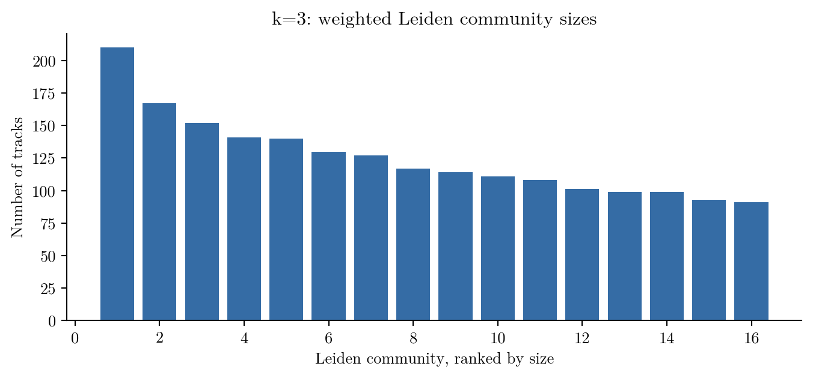
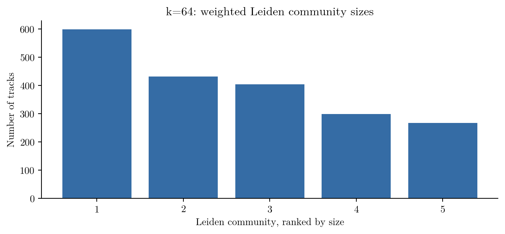
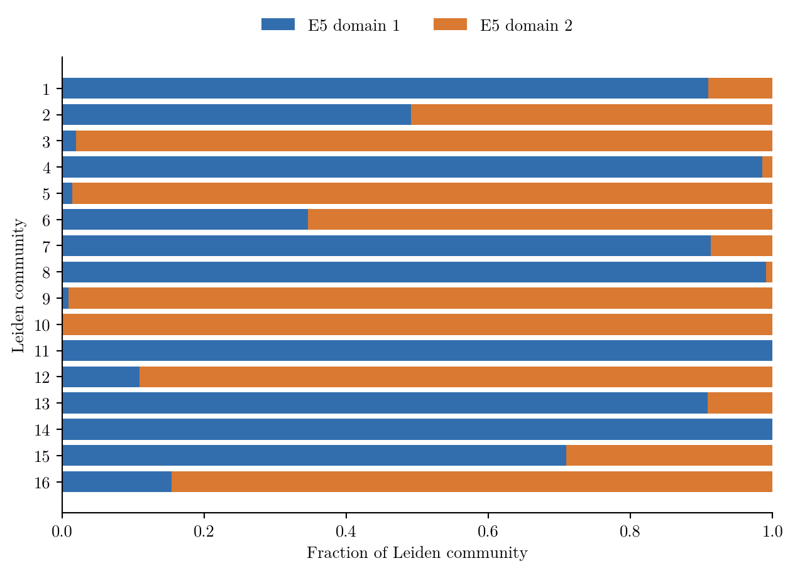
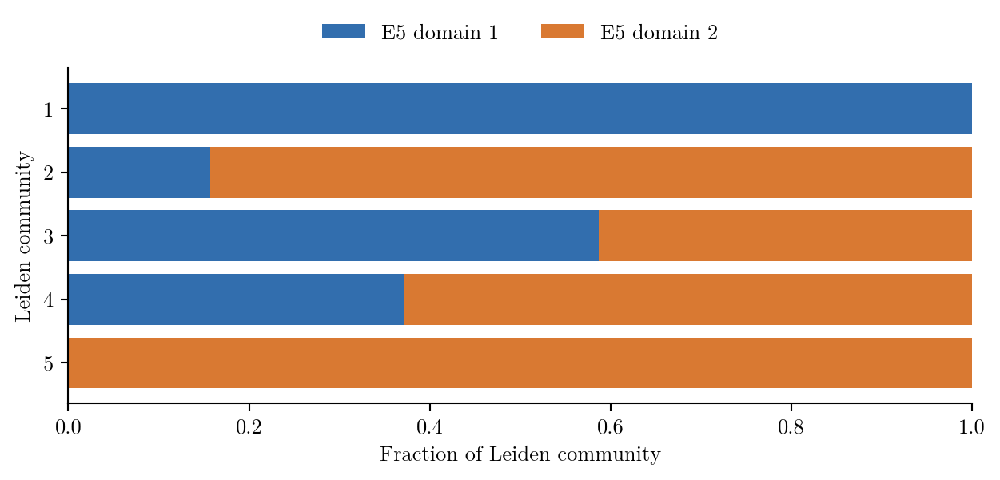

# E6：加权 Leiden 社区发现（k=3 与 k=64）

## 分析对象与方法

本分析读取仓库已保存的 32 维 PCA、Gaussian 相似度所构成的无向加权 union-kNN 图，不重新建图。主分析选用第一次全图连通的 **k=3**；**k=64** 使用相同方法检验图变密后的结果。两张图均包含 2,000 首歌曲。Leiden 在原始正边权上优化标准加权 Newman–Girvan 模块度，分辨率参数 γ=1。算法自动确定社区数；genre、mood/theme 标签与 E5 节点域均不参与优化。

每张图使用 521–525 五个种子独立运行，取模块度最高的一次作为代表划分。`restarts.csv` 保留五次运行的目标值和社区规模；社区编号按代表划分的规模降序排列，同规模时按最小原始节点索引排序。编号只在各自的 k 内有意义。

## 主要结果

| 图 | 无向边数 | 社区数 | 社区规模 | 加权模块度 Q | 五次运行两两 ARI 中位数 | 与 E5 两域的 ARI |
| --- | ---: | ---: | ---: | ---: | ---: | ---: |
| k=3 | 4,888 | 16 | 91–210 | 0.7159 | 0.493 | 0.087 |
| k=64 | 96,867 | 5 | 267–598 | 0.4646 | 0.766 | 0.263 |





k=3 的稀疏图形成较多的中等规模社区，k=64 的密图形成较少且更大的社区。两个代表划分按原始歌曲索引对齐后的 ARI 为 **0.222**。全部代表社区在各自的图内均连通，逐歌曲归属见 `k003/nodes.csv` 和 `k064/nodes.csv`。

## 稳定性与 E5 对照

k=3 的五次运行产生 16–17 个社区，两两 ARI 中位数为 0.493；k=64 产生 5–6 个社区，中位数为 0.766。因此 k=3 的具体小社区成员对随机初始化较敏感，不宜只凭一次划分给它们固定类别名称。

E5 的 q₂ 正负节点域是两个大区域，Leiden 社区是另一种划分。两者的逐歌曲交叉表位于 `kXXX/e5_overlap.csv`，图示如下；Leiden 社区可主要落在某个节点域，也可能跨越两个域。





`kXXX/e5_embedding_communities.png` 把 Leiden 归属画在 E5 的 `(q₂, q₃, q₄)` 坐标上；这些坐标由 E5 计算，Leiden 并未重新学习嵌入。

## 音乐标签与解释范围

在两端均有 genre 标签的边中，k=3 社区内部的边有 **38.08%** 共享至少一个 genre，社区之间为 **37.08%**；k=64 分别为 **34.68%** 和 **29.37%**。标签分析是在社区确定后进行的描述，并非算法输入或独立的分类准确率检验。歌曲可以带多个 genre 或 mood/theme 标签，所以各标签比例不必相加为 100%。各社区的计数、有效分母、比例和 lift 见 `kXXX/genre_by_community.csv` 与 `kXXX/mood_theme_by_community.csv`。

两张图的边集与模块度零模型不同，不能仅凭 Q=0.7159 与 Q=0.4646 给聚类质量排序。跨 k 的 ARI 比较的是社区成员一致程度，也不表示哪一种划分更正确。重复艺术家、样本选择、声学特征和图参数都可能影响结果。

## 文件与复现

- `kXXX/metrics.json`：图哈希、算法参数、模块度、重跑稳定性和对照指标。
- `kXXX/restarts.csv`：五个种子的运行结果。
- `kXXX/nodes.csv` 与 `membership.npy`：逐歌曲归属；数组下标为原始 `node_index`。
- `kXXX/communities.csv`、`community_features.csv`：社区规模、内部及边界连边、声学特征等。
- `comparison.csv`、`cross_k_comparison.json`：两张图的汇总与跨 k 比较。

从仓库根目录运行，先按 [`E4/E5 扩展说明`](../E4_E5_extension/README.md)生成 E5 节点域，再执行：

```sh
python -m pip install -r code/requirements.txt
python -m pip install -r results/E6/requirements.txt
python code/analyze_e6.py
```

脚本读取 `results/graphs/`、节点与特征文件，以及 `results/E4_E5_extension/kXXX/spectral_data.npz`，输出写入 `results/E6/`。现有结果的依赖版本记录在 `environment.json`。
